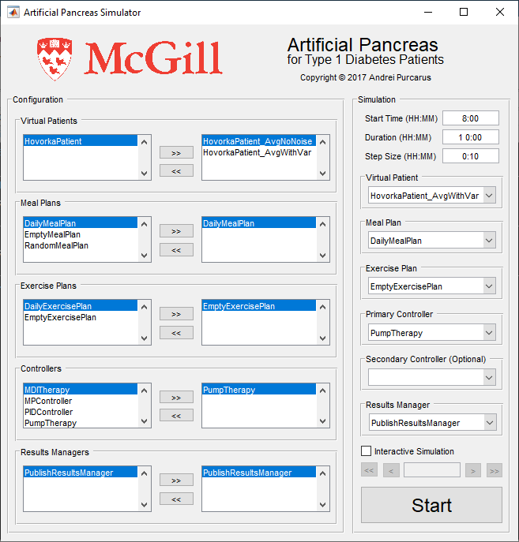

# Artificial Pancreas Simulator

A simulation environment for artificial pancreas type 1 diabetes treatments.

## Overview

The simulator is divided into three components: the virtual patient, the infusion controller and the results manager. Each component can be configured by the user to customize the simulation.

#### Virtual Patient

The virtual patient defines the patient model used in the simulation. It defines the dynamics of the gluco-regulatory system after infusion of a drugs such as insulin or glucagon, as well as after meals consumption or exercise. It is embodied by the [`VirtualPatient`](https://github.com/McGillDiabetesLab/artificial-pancreas-simulator/blob/master/simulator/%40VirtualPatient/VirtualPatient.m) class.   
Part of this component are the [`MealPlan`](https://github.com/McGillDiabetesLab/artificial-pancreas-simulator/blob/master/simulator/%40MealPlan/MealPlan.m) and [`ExercisePlan`](https://github.com/McGillDiabetesLab/artificial-pancreas-simulator/blob/master/simulator/%40ExercisePlan/ExercisePlan.m) classes, which define when the patient receives meals or exercises and the corresponding quantities.

#### Infusion Controller

The infusion controller defines the algorithm used to control the administration of infusions to the patient. It uses blood glucose readings from the patient, as well as meal and exercise information, to set the basal and bolus rates of hormones such as insulin and glucagon. It is embodied by the [`InfusionController`](https://github.com/McGillDiabetesLab/artificial-pancreas-simulator/blob/master/simulator/%40InfusionController/InfusionController.m) class.

#### Results Manager

The results manager defines how the results should be accumulated during the simulation and how the results should be presented to the user after the simulation has completed. It is embodied by the [`ResultsManager`](https://github.com/McGillDiabetesLab/artificial-pancreas-simulator/blob/master/simulator/%40ResultsManager/ResultsManager.m) class.

## Structure

This repository is structured as follows

    .
    ├── simulator
    ├── library
    │   ├── virtual-patients
    │   ├── controllers
    │   ├── exercise-plans
    │   ├── meal-plans
    │   ├── results-managers
    │   └── utilities
    ├── templates
    ├── docs
    └── ...
### Simulator

The core implementation of the simulator is here. The simulator provides the back-end framework which handles communication between libraries, real-time simulation, and GUI. Each component of the simulator is well documented, and documentation can be accessed by:

```Matlab
doc ArtificialPancreasSimulator
```

### Library

Minimal implementation of different component of the simulator. Users are encouraged to make their implementations or to improve existing ones.

### Templates

In this folder you can find empty template which can serve as a starting point for your own library implementation.

### Docs

This folder contains additional documentation.

## Usage

### Graphical User Interface

The user interface can be used by running:

```Matlab
guiSimulation
```

As a result the following GUI should show.



The GUI is composed of two parts **Configuration** and **Simulation**. In configuration, it is possible to reconfigure each component. In simulation, you can select the desired configuration to simulate.

For a quick start run **Start**. In the configuration section, it is possible to create different flavors of the same module with different options. By default, we create 2 instances of **HovorkaPatient** one called **HovorkaPatient_AvgNoNoise** and the other **HovorkaPatient_AvgWithVar**. These represents 2 different configurations of the same **HovorkaPatient** module.

By default, the simulator look at all folder classes defined in [getLibraryPaths](https://github.com/McGillDiabetesLab/artificial-pancreas-simulator/blob/master/getLibraryPaths.m). It is possible to modify **getLibraryPaths** to add your custom path, more on this here [Adding User Functions](docs/Adding-User-Functions.md).

### Scripts

A sample simulation can be excuted by running:

```Matlab
simulation
```

This simulator can be used as a library from anywhere in your local repository. For this you need to configure the path to include the _artificial pancreas simulator_. For this, we write:
```Matlab
run('[YOUR PATH]/artificial-pancreas-simulator/configurePaths');
```

Next we should configure the simulator options using `SimulatorOptions`

```Matlab
options = SimulatorOptions;
```

Minimal `SimulatorOptions` can be set by: 

```Matlab
options.simulationStartTime = 8 * 60; % minutes
options.simulationDuration = 24 * 60; % minutes
options.simulationStepSize = 10; % minutes
options.virtualPatients = {{ ...
    'HovorkaPatient', ...
    'DailyMealPlan', ...
    'EmptyExercisePlan', ...
    'PumpTherapy'}};
```

In this example, we want to run a 24h simulation, starting at 8am, with a step size of 10 min. The simulation will use `HovorkaPatient` for the virtual patient simulation, the meals that will be consumed by this patient are described in `DailyMealPlan`, the patient will not exercise `EmptyExercisePlan`, and the patient will use a standard insulin pump for his insulin treatment `PumpTherapy`.

Observe how `options.virtualPatients` is a double cell using `{{`, `}}`. This is done since the `virtualPatients` option support multiple patient definition, see `example/multiPatientSim.m` for an example.

We need to specify the format in which the results should be done, we do this by:

```Matlab
options.resultsManager = 'PublishResultsManager';
```

Now, we can run the simulation by doing:

```Matlab
simulator = ArtificialPancreasSimulator(options);
simulator.simulate();
```

This procedure is implemented in `example\inlineSim.m`.

### Example of expected result


## Additional Resources

- [Software Requirements Specification](docs/Software-Requirements-Specification.md)
- [Detailed Script Simulation](docs/Detailed-Script-Simulation.md)
- [Multiple Patient Simulation](docs/Multiple-Patient-Simulation.md)
- [Adding User Functions](docs/Adding-User-Functions.md)

## Credits

This simulator was designed by the team in [McGill Artificial Pancreas Lab](https://www.mcgill.ca/haidar/), mainly:
- [Andrei Purcarus](https://github.com/Gripnook): Implemented the simulator backbone code.
- [Anas El Fathi](https://github.com/anaselfathi): Implemented library modules, and provides long-term support.
- Prof. Ahmad Haidar: Provided overall supervision and feedback.

A schalary paper about the simulator is in-progress, meanwhile, if you find this simulator usefull please feel free to cite our review paper describing BergmanPatient and MPController.

```
A. El Fathi, M. Raef Smaoui, V. Gingras, B. Boulet and A. Haidar, "The Artificial Pancreas and Meal Control: An Overview of Postprandial Glucose Regulation in Type 1 Diabetes," in IEEE Control Systems Magazine, vol. 38, no. 1, pp. 67-85, Feb. 2018, doi: 10.1109/MCS.2017.2766323.
```

## Contact and Issues

For additional assistance, please use [GitHub Issues](https://github.com/McGillDiabetesLab/artificial-pancreas-simulator/issues).
